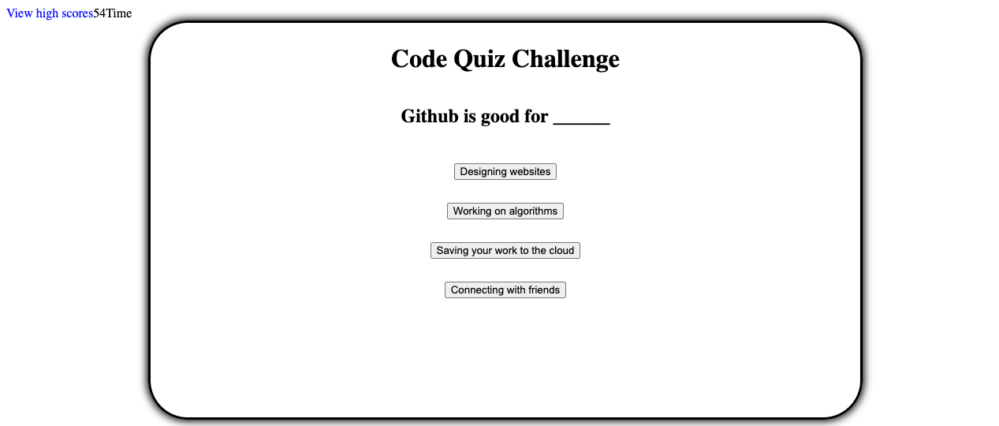

# coding-quiz
***
This assignment required me to develop an online coding quiz. It had to be interactive with a timer and mulitple choice buttons. The user had to be greeted with a message and a start button. When the start button was clicked a question appeared and if answered incorrectly, 10 seconds were deducted from the time. Although this assignment was challenging, it was a good learning expereince. 
***
site:  https://armando1236.github.io/coding-quiz/
Github: https://github.com/armando1236/coding-quiz.git
***
used JavaScript, CSS, and HTML on Visual Studio Code
***
